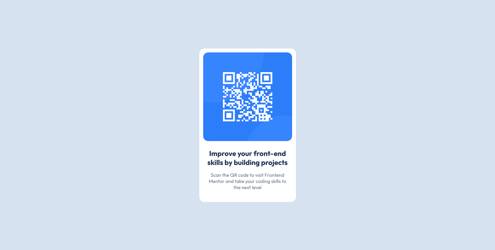

# Frontend Mentor - QR code component solution

This is a solution to the [QR code component challenge on Frontend Mentor](https://www.frontendmentor.io/challenges/qr-code-component-iux_sIO_H). Frontend Mentor challenges help you improve your coding skills by building realistic projects.

## Table of contents

- [Overview](#overview)
  - [Screenshot](#screenshot)
  - [Links](#links)
- [My process](#my-process)
  - [Built with](#built-with)
  - [What I learned](#what-i-learned)
- [Author](#author)
- [Acknowledgments](#acknowledgments)

## Overview

This is my first project. Here is the details how I did it. First I imported google font then I made a card elemnt. Inside that card, You put img element and another div that holds 2 elements headling element and paragraph elemnt. So this was html. In Css, I did use root selector to hold multiple variables (colors). To center the card, I used flex property. Thank you.

### Screenshot



### Links

- Solution URL: [Add solution URL here](https://github.com/MgMyatHtayKhant/qr-code-component-main)
- Live Site URL: [Add live site URL here](https://gilded-tapioca-a465f3.netlify.app/)

## My process

### Built with

- Semantic HTML5 markup
- CSS custom properties
- Flexbox
- Mobile-first workflow

### What I learned

In this project, I learned how to use root selector for how to create variables so I can use it at multiple places and change them at one place and flex box property.

```css
:root {
  --body-background-color: hsl(212, 45%, 89%);
  --card-background-color: hsl(0, 0%, 100%);
  --card-title-color: hsl(218, 44%, 22%);
  --card-description-color: hsl(216, 15%, 48%);
}

body {
  width: 100vw;
  height: 100vh;
  margin: 0;
  background-color: var(--body-background-color);
  display: flex;
  align-items: center;
  justify-content: center;
}
```

## Author

- Website - [Saul](https://saul-homepage.netlify.app/)
- Frontend Mentor - [@yourusername](https://www.frontendmentor.io/profile/yourusername)

## Acknowledgments

This project is done by myslef and I'm proud of it.
